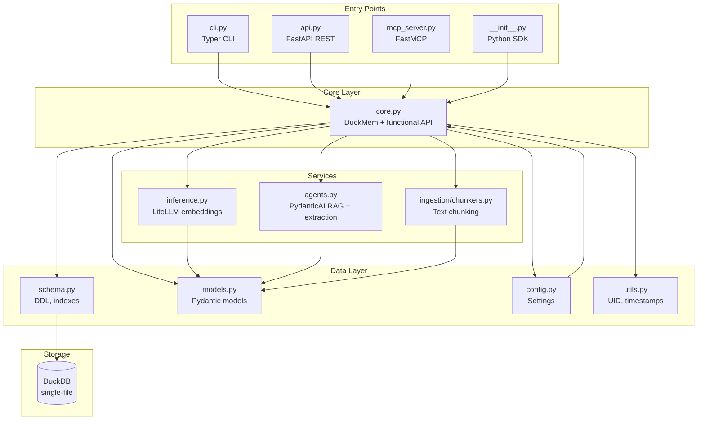
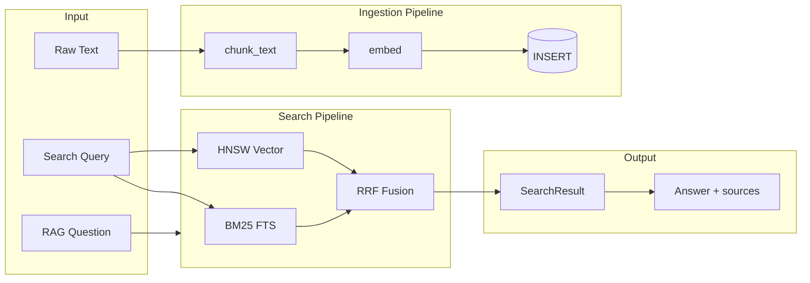
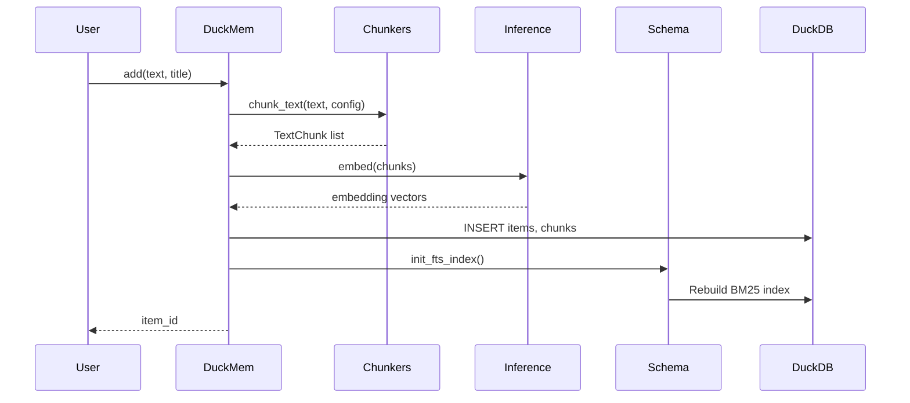
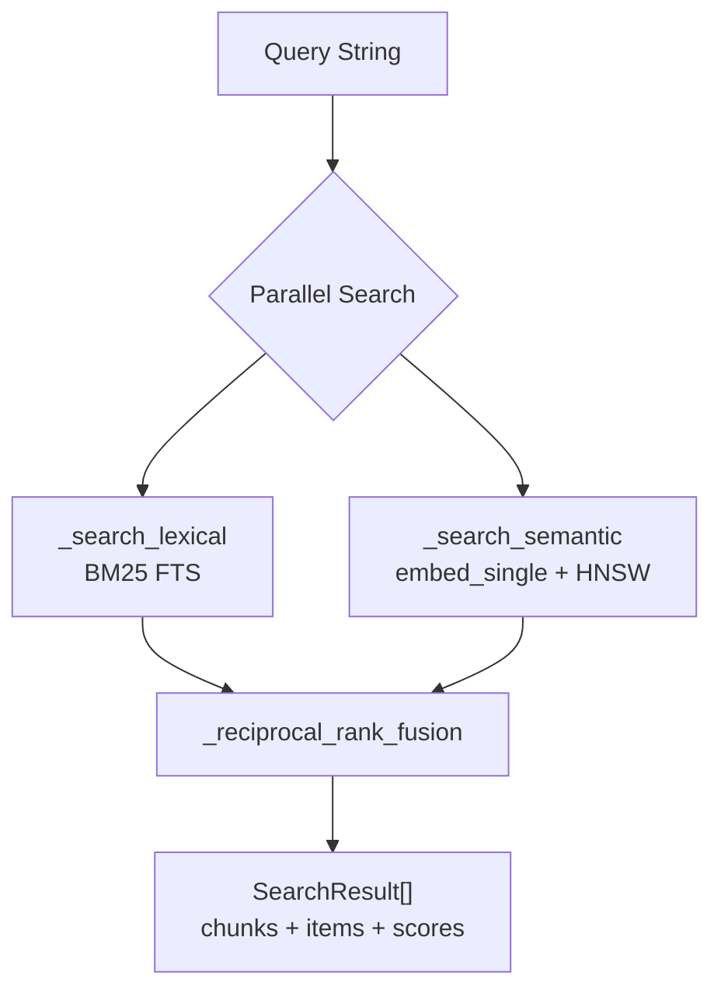
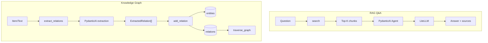
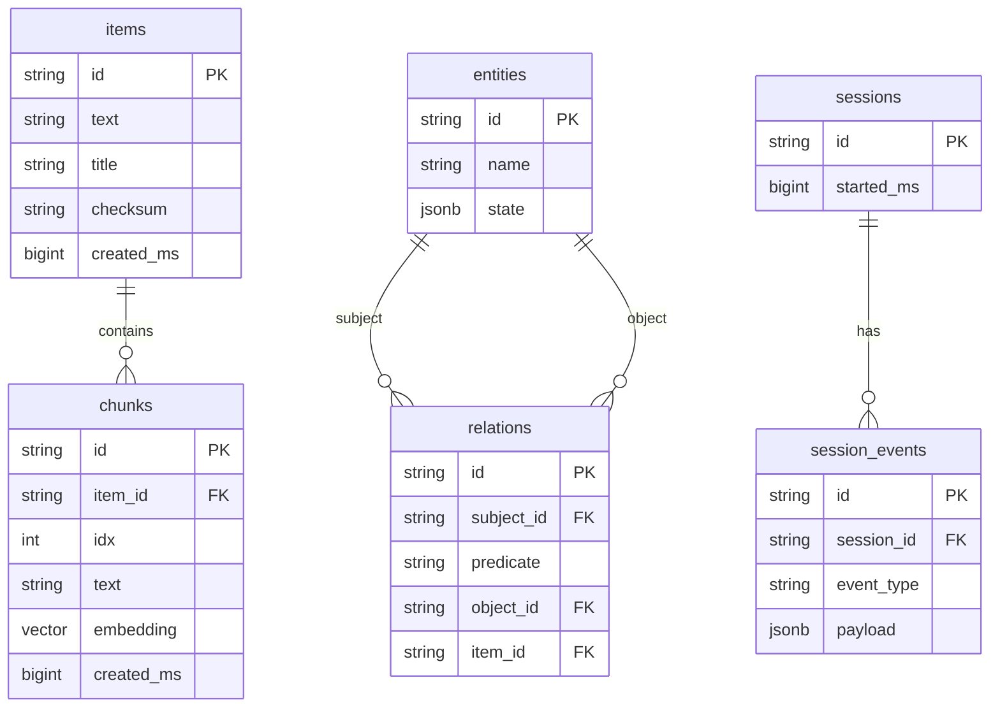
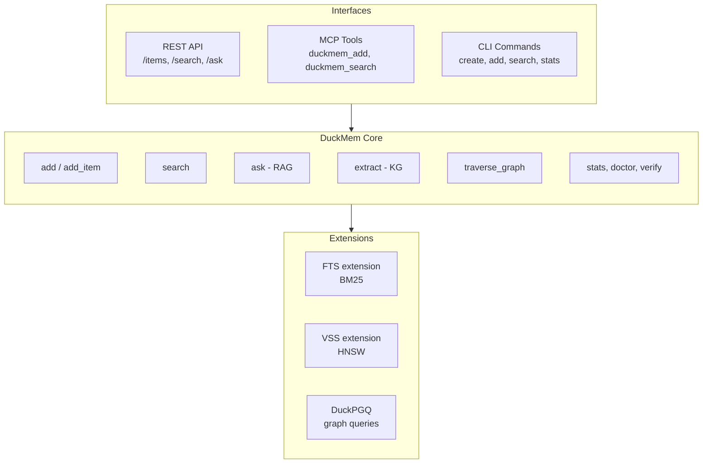

# DuckMem Codebase Architecture

## 1. Module Dependency Diagram

## 2. Data Flow Overview

## 3. Ingestion Flow (Detail)

## 4. Hybrid Search Flow

## 5. RAG & Knowledge Graph Flow

## 6. Database Schema

## 7. Component Overview

---

*Generated from DuckMem codebase analysis. View in any Mermaid-compatible renderer (GitHub, VS Code, Mermaid Live Editor).*
